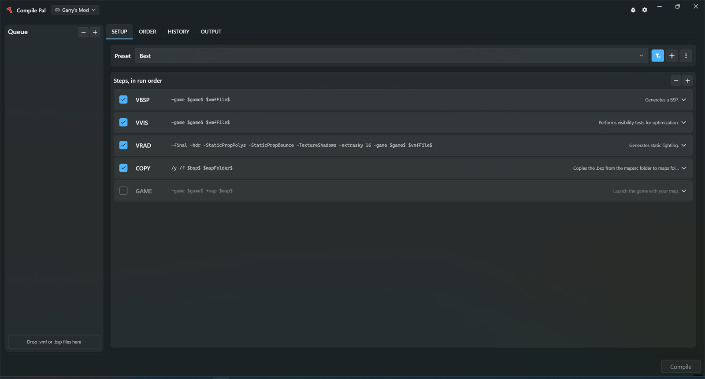

<p align="center">
	
</p>

<p align="center">An easy to use wrapper for the Source Engine map compiling tools.</p>

<p align="center">
	<em>A fork of <a href="https://github.com/ruarai/CompilePal">ruarai/CompilePal</a>, with a rebuilt
	interface, faster setup, and better failure reporting.</em>
</p>



## Downloads

Windows only. Self-contained - no .NET install required.

#### Latest release

[**Download the latest release**](https://github.com/catualus/CompilePal/releases/latest)

#### Pre-release builds

New features before they are settled. Expect rough edges.

[Latest pre-release](https://github.com/catualus/CompilePal/releases)

Looking for the original? It lives at [ruarai/CompilePal](https://github.com/ruarai/CompilePal).
Version numbers here are unrelated to its own - see [Versioning](#versioning).

## What this fork changes

Everything below is new since the fork point. The compile tooling itself is unchanged - this is
the same VBSP/VVIS/VRAD wrapper, with the parts around it rebuilt.

### Interface

* **Rebuilt main window**, organised around the compile itself: a map queue, the steps in run
  order with their arguments visible, and separate tabs for order, history and output.
* **Follows your Windows light/dark setting**, or can be pinned to either in Settings.
* **Every step says what it does** on its own row, instead of requiring you to know already.
* **Searchable step and preset pickers**, rather than a long unordered list.
* **The output font is yours to choose** from the monospace families you have installed.

### Setup

* **Finds your Source games automatically** by scanning your Steam libraries, instead of asking
  you to point at each `gameinfo.txt` by hand.
* **Detects Hammer++ compile tools** next to the stock ones and prefers them, so `vbsp++` and
  friends are used without reconfiguring anything. Can be forced on or off.
* **Says which game configuration key is missing** when one cannot be read, instead of dropping
  the game silently.

### While compiling

* **A progress bar that means something.** Steps are weighted by how long they have actually
  taken on previous runs, so it moves at a roughly constant rate instead of stalling through
  VVIS and then leaping.
* **An estimate of time remaining**, once there is history to base one on.
* **An issues list** collecting every recognised error and warning, each one clickable to jump
  to where it happened in the output.
* **Jump between compile steps** in the output rather than scrolling for the next banner.
* **Search the output**, with matches highlighted.
* **Per-map result chips** - succeeded, failed or cancelled, with duration and error counts.

### After compiling

* **Compile history**, with the full log of previous runs kept and viewable.

### Errors

* **Error descriptions render in a modern browser engine** (WebView2) rather than the
  Internet-Explorer-era control, and are **readable in dark mode** - they previously came out as
  dark text on a dark background.
* **Error recognition works offline.** The catalogue ships with the app, so a fresh install still
  explains compile errors when the upstream error site is unreachable - which it frequently is.
* **Extra error definitions** for messages the original catalogue predates.

### Automatic fixes

* **VMFFIX**, an optional compile step that repairs map problems before compiling. Every repair is
  a defect with a single correct answer - nothing here guesses at what you meant.

  *Stops the compile if left alone:*
  * displacements tied to a brush entity - moved back into the world, and the entity removed if that
    leaves it empty;
  * `func_areaportal` with more than one brush - split into one areaportal per brush;
  * overlays whose render order is outside the 0-3 the format allows;
  * brush entities containing no brushes.

  *Silently changes or deletes part of your map if left alone:*
  * `prop_static` whose model lacks `$staticprop` - VBSP **deletes** these, so they become
    `prop_dynamic_override` (with a warning if enough are converted to matter for the edict budget);
  * `prop_physics` whose model has no propdata - VBSP cannot create these at all;
  * light falloff distances entered the wrong way round, which VRAD silently overrides;
  * prop fade distances the wrong way round, which makes props vanish instead of fading;
  * a `skyname` written as a file path, which compiles a black sky.

  It also **reports** faults it will not touch - origin brushes in the world, displacements on
  non-quad faces, props with no model set, and VMT problems - because they have more than one
  reasonable fix, and finding out now beats finding out twenty minutes into a compile.

  Every check can be turned off individually, there is a dry run, and the map is backed up first.
  The file is edited line by line rather than re-serialised, so a map that needs no changes saves
  back byte for byte.

### Presets

* **More presets out of the box** - Draft, Fast, Good, Best, Best (tools++), and Publish and Full
  variants for LDR, HDR and both.
* **Compare two presets side by side** to see exactly which parameters differ.

### Reliability

* Compiles no longer abort part-way through on a queue change.
* A cancelled compile no longer leaves its last partial line at the top of the next run's output.
* The error catalogue is no longer re-downloaded on every shutdown, which used to exhaust the
  source's rate limit within a few launches and stop error descriptions loading at all.
* Asset paths from a map can no longer escape your content folders when packing.

### Privacy

Compile Pal sends **nothing** unless you turn usage reporting on in Settings. It is off by
default, and there is no first-run prompt that quietly opts you in.

If you do turn it on, one summary goes out as the app closes: how many times you launched it and
compiled, how many compiles succeeded, failed or were cancelled, how many errors were recognised,
the app version and Windows build, and which of the supported games you used.

It carries **no identifier of any kind** - no account, no machine ID, no fingerprint, nothing that
distinguishes your install from anyone else's. Map names, file paths, presets and compile output
are never sent.

**Settings → Privacy → Show what is sent** prints the exact message before it goes anywhere, so
you can check rather than take our word for it.

<details>
<summary>Technical detail</summary>

Nothing is queued to disk; a failed send is dropped rather than retried. The destination is
compiled into official builds rather than being a setting, so **a build that is not ours reports
nowhere at all** - build from source and nothing is sent whatever the toggle says.

The game name is matched against the list of games Compile Pal ships a configuration for and
reported as `other` otherwise, so a renamed configuration never leaves your machine.

Aggregate totals are public at
[/api/telemetry/v1/stats](https://telemetry.catualus.dev/api/telemetry/v1/stats), and deliberately
coarse. "Aggregate" stops meaning "anonymous" when a sum describes one person, so the endpoint
reports weeks rather than days, withholds any figure covering fewer than 5 installs, publishes
nothing until a window covers 25 install-days, never reports your OS version, and never combines
those dimensions. Where rows are withheld it says how many.

Distinct installs are counted without an identifier: the server derives a bucket from the
connection address under a salt it replaces every midnight and never keeps, so yesterday's counts
cannot be linked to today's by anyone, including us.

</details>

The original Compile Pal reports usage from every install with no way to refuse. This fork does
not, and none of its data reaches the original's collectors.

## Guides
* [Quick Start](Guides/QuickStart.md)
* [Reporting An Issue](Guides/Issues.md)
* [Plugin Development (Beta)](Guides/Plugins.md)
* [Custom Compile Steps](Guides/Custom.md)
* [Custom Compile Step Collection](Guides/CustomCollection.md)
* [Command Line Arguments](Guides/CMDArgs.md)
* [Registry Values](Guides/Registry.md)
* [VScript Packing Hints](Guides/VScript.md)

## Building

Compile Pal links [NavPal](../../../NavPal), the offline navigation mesh generator behind the NavPal
compile step, which lives in its own repository. Clone with submodules so it comes along:

```bash
git clone --recurse-submodules <this repo>
```

If you already cloned without them:

```bash
git submodule update --init --recursive
```

A checkout of NavPal sitting beside this repository is also picked up automatically, which is
convenient when working on both at once. If neither is present the build stops with a message saying
so rather than a wall of unresolved-type errors.

## Contributing

New features and bugfixes are welcome - open a pull request, or
[report an issue](https://github.com/catualus/CompilePal/issues) here.

Please report bugs against **this fork** rather than upstream unless you can reproduce them in
[the original](https://github.com/ruarai/CompilePal) too. Most of what has changed here is not
theirs to fix.

### This fork
- [catualus](https://github.com/catualus)

### Original Compile Pal
- [ruarai](https://github.com/ruarai)
- [maxdup](https://github.com/maxdup)
- [Exactol](https://github.com/Exactol)
- iMilo


### Bug testing, original Compile Pal
- wareya
- Gangleider
- Matt2468rv
- Sevin7

These people tested the original Compile Pal, not this fork. Bugs you find here are almost
certainly ours.
